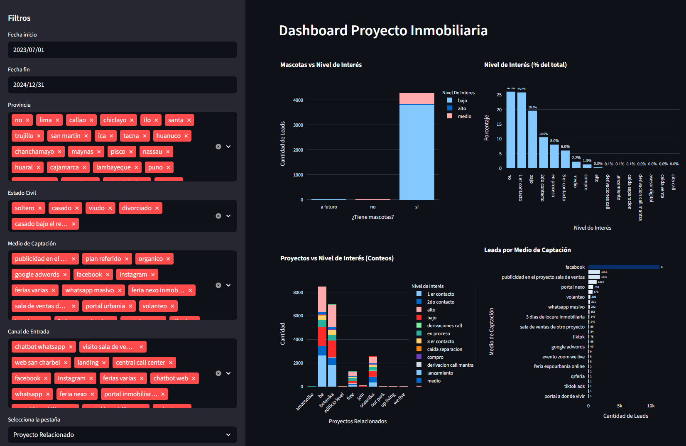

# 🔗 Python UTEC - Grupo 5: Automatización de reportes comerciales con Python en la industria inmobiliaria


Este proyecto fue desarrollado por el **Grupo 5** de **UTEC** como parte de un curso de programación en Python. Este proyecto propone desarrollar una solución en Python que integre automatización de datos y técnicas de aprendizaje automático, con el objetivo de estimar la probabilidad de conversión de leads y generar reportes comerciales confiables.

---

## 🚀 Características

- ✅ **Flujo de datos reproducible**:
    - ingesta programada de fuentes operativas (por canal y proyecto), limpieza, estandarización y anonimización bajo buenas prácticas.
- ✅ **Modelado supervisado**: 
    - construcción de un conjunto de variables, entrenamiento de modelos base y avanzados .
- ✅ **Entrega accionable**:
    - un dashboard interactivo que muestre la data actualizada, predicciones por lead y KPI operativos para priorización diaria, además de reportes automáticos con frecuencia definida.

---

## 📸 Capturas de pantalla

| Interfaz | QR Code Output |
|----------|----------------|
|  |  |
|  |


---

## 🗂  Estructura del Proyecto

```
├── app.py                   # Aplicacion principal
├── img/                     # imagenes del proyecto
├── requirements.txt         # dependencias del proyecto
├── runtime.txt              # version de python
├── .gitignore               # archivos que no se suben a github
├── readme.md                # descripcion y instrucciones del proyecto
```

---

## 🧪 Instrucciones de Instalación (con Entorno Virtual en VS Code)

Siga estos pasos para configurar y activar un entorno virtual en su proyecto usando Visual Studio Code con el terminal `Command Prompt`:

### 1. Abrir el terminal en VS Code
- Abra VS Code.
- Use the shortcut: `Ctrl + ` (backtick) or go to **View > Terminal**.
- Make sure you are using `Command Prompt` as the terminal. You can switch terminals from the dropdown menu in the top-right corner of the terminal panel.

### 2. Validate Python installation
Make sure you have **Python 3.8+** installed.

```bash
python
```

### 3. Crear el entorno virtual
Ejecutar el siguiente comando en la raíz de su proyecto:

```bash
python -m venv venv
```
Esto creará una carpeta llamada venv que contendrá su entorno virtual.


### 4. Activar el entorno virtual
En Command Prompt, ejecutar en windows:

```bash
venv\Scripts\activate
```
En Command Prompt, ejecutar en linux:

```bash
source venv/bin/activate
```

### 5. Instalar dependencias
Después de activar, instalar los paquetes requeridos en el siguiente paso.

```bash
pip install -r requirements.txt
```

---

## ▶️ How to Use

### 1. Ejecute la App con:

Run the main script:

```bash
streamlit run app.py
```

---

## 📁 Salida del proyecto

- Dashboard con filtros con  Nivel de Interes
- Dashboard con filtros con  Nivel de Interes
- Reportes 
---

## 👨‍👩‍👧‍👦 Miembros del equipo 📚

- Rolando Abraham Mamani Flores [@rolando-d3v](https://github.com/rolando-d3v) 
- Cesar Ponce Rojas
- Jesus Maldonado Llacsahuanga	
- Stephany Leticia Flores Cadillo
- Elmer Dante Rojas Zuta
